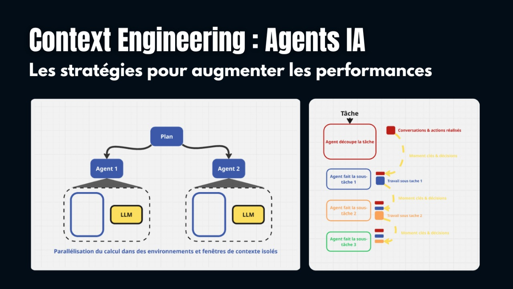
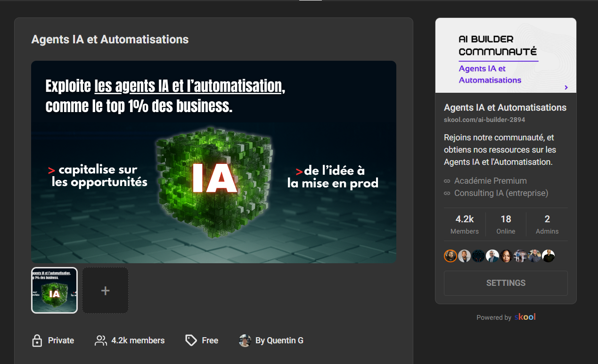
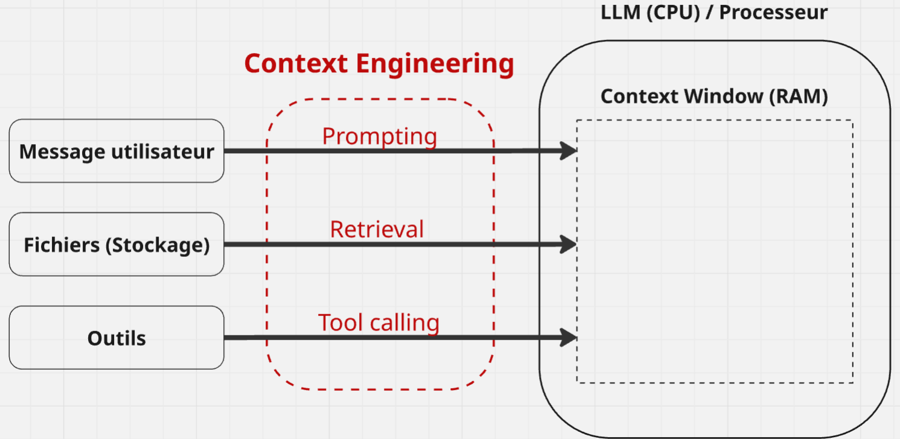
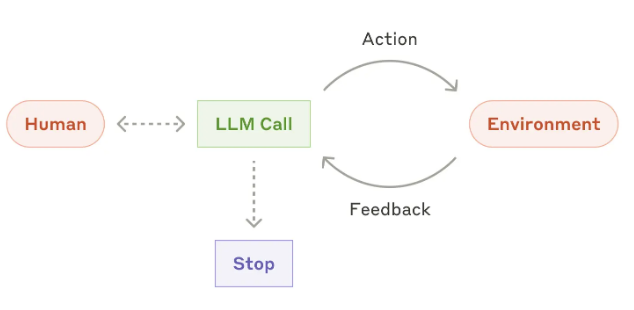
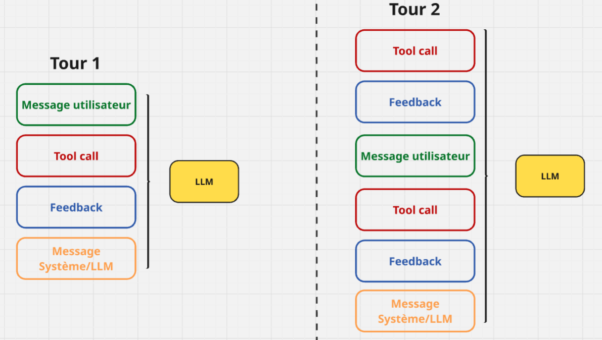
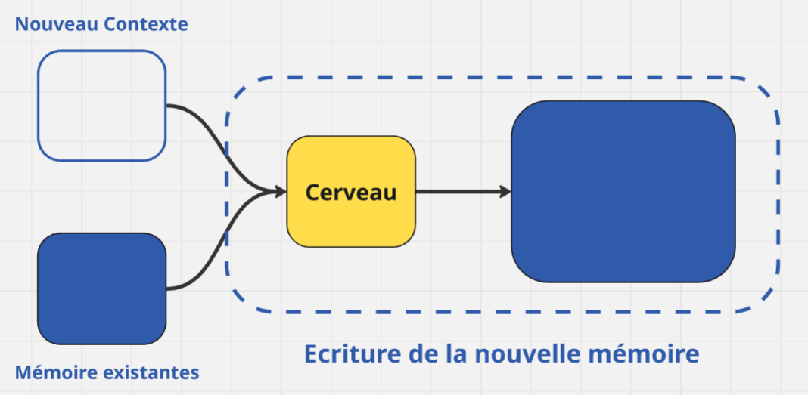
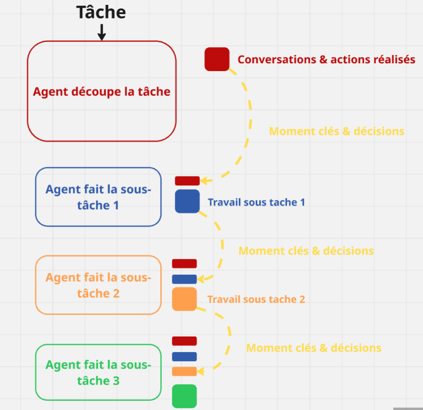
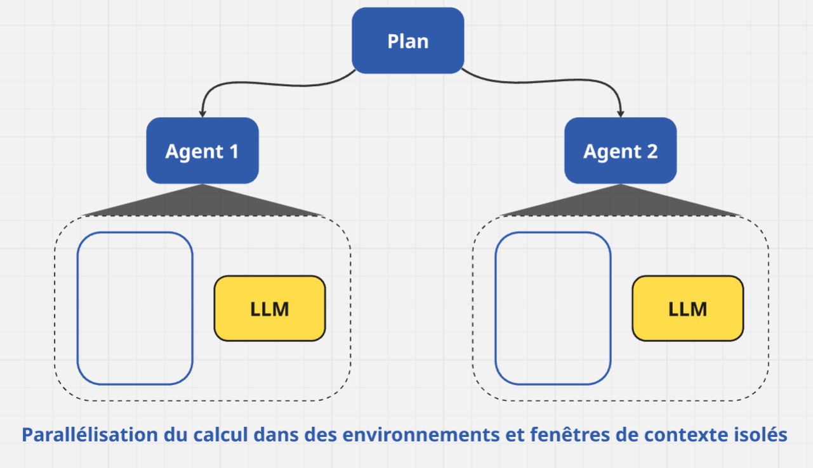
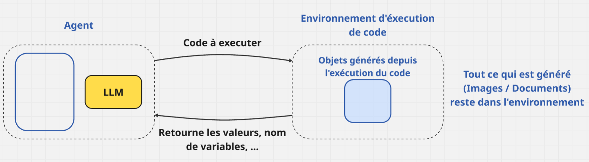

# Context Engineering pour tes Agents IA

Les stratégies à adopter pour construire des Agents IA robustes

# [Context Engineering pour tes Agents IA](https://youtu.be/53oFRKAOeYI?si=UQF6rc7fs3L0ih0F)

---

# [Communauté n°1 sur les Agents IA](https://www.skool.com/ai-builder-2894/about)

---

# Context Engineering?

Les Agents IA pour interagir avec leurs environnement ont besoin de contextes sur celui-ci pour performer sur la tâche donnée.

## **Cest quoi ?**

> ### **Context Engineering** : L'art de remplir la fenêtre de contexte d'un LLM avec juste les bonnes informations pour la prochaine étape/tâche.

<!--
You can have `style` tag in markdown to override the style for the current page.
Learn more: https://sli.dev/features/slide-scope-style
-->

<!--
Here is another comment.
-->

---

## Les différentes **sources de contexte** (Types)

- [ ] **Instructions**
- [ ] **Connaissance externe (RAG,Base de données,...)**
- [ ] **Outil à disposition**
- [ ] **Feedback d'outils**

---

# Pourquoi sur les Agents IA c'est très complexe?

1. Les **Agents IA** bouclent pour performer **des tâches plus complexes**
2. Les **Agents IA** utilisent souvent énormement de tokens

---

<Tweet id="1937033436746903741" scale="0.70"/>

### Les différentes situations où le contexte rate

- #### **Context Poisoning** : Quand une hallucination rentre dans le contexte
- #### **Context Distraction** : Quand le contexte dépasse l'entrainement
- #### **Context Confusion** : Quand du contexte superflue influence la réponse
- #### **Context Clash** : Quand des parties du contexte sont en désaccord

> ### Le Context Engineering devient **critique** quand on **construit** des agents

---

# Les stratégies de contrôle du contexte

### 1. **Ecriture du contexte** : _**Sauvegarder** du contexte en dehors de **la fenetre** du LLM pour aider l'agent à faire la tâche._

### 2. **Selectionne le contexte** : _**Envoyer** dans la fenêtre de contexte du LLM uniquement les informations pertinentes pour la tâche_

### 3. **Compresser le contexte** : _Retenir uniquement les **tokens/informations** requises pour la tâche_

### 4. **Isoler le contexte** : _**Séparer** pour aider l'agent sur la tâche_

---

# Ecriture de contexte

> **Sauvegarder** du contexte en dehors de **la fenetre** du LLM pour aider l'agent à faire la tâche.

## Comparaison avec notre manière de raisonner (humain) sur une tâche

Les humains résouent des tâches, en prenant des notes et en se rappelant de choses pour le futur liés à la tâche.

1. **Notes** ---> Bloc-notes (ScratchPad)
2. **Se Rappeler** ---> Mémoire

---

## Méthode de Bloc-notes (ScratchPad)

> Concept de de **persister** l'information pendant qu'un agent réalise une tâche

Exemples [Anthropic multi-agent researcher](https://www.anthropic.com/engineering/multi-agent-research-system) :

> _L'agent LeadResearcher commence par penser à l'approche and **sauvegarde** le plan dans sa **Mémoire** pour persister le context, si la **fenêtre de contexte** dépasse 200k tokens il sera tronqué et il est important de retenir le plan._

Pour palier à ce problème on peut mettre un **objet d'état** (runtime) ou un fichier

## Méthode de Mémoire

1. **Generative Agents** synthétisent la mémoire des collections des feedback des anciens agents
2. **ChaGPT**, **Cursor**, **Windsurf** générent automatiquement leurs mémoires.

---

# Sélection de contexte

> #### _**Envoyer** dans la fenêtre de contexte du LLM du contexte qui **aide l'agent à réaliser la tâche**_

### [Scratchpads]()

- [ ] Appel d'outils
- [ ] L'état de conversations

### [Mémoires]()

- [ ] Few-shots examples ---> **(mémoire épisodique)**
- [ ] Instructions ---> **(mémoire procédural)**
- [ ] Faits ---> **(mémoire sémantique)**

---

# Tableau des différents type de mémoires

- Instructions ---> **Rules files / CLAUDE.md (PRD)**
- Faits ---> **Collections**

| Type de mémoire | Ce qui sauvegarde | Exemple Humain                 | Exemple d'agent              |
| --------------- | ----------------- | ------------------------------ | ---------------------------- |
| **Semantique**  | Faits             | Choses qu'on apprend à l'école | Des faits sur l'utilisateur  |
| **Episodique**  | Experiences       | Choses que tu as faits         | Actions passèes de l'agent   |
| **Procédurale** | Instructions      | Instint ou la motricité        | Le Système prompt de l'agent |

---

# Exemples de cas concrets

## Outils

- RAG sur la description des outils : [Une recherche récente]() montre que ca améliore la qualité de la selection de l'outils 3x

## Connaissances

- RAG
- **Code Agent** : Les plus grosses RAG apps (large-scale)

<Tweet id="1899630200780153274" scale="0.7"/>

<Tweet id="1899630246862966837" scale="0.7"/>

---

# Synthèse/Compression du contexte

> **Retenir** uniquement les **tokens/informations** requises pour la tâche

## **Synthétiser**

- **Claude Code** auto compact : [Anthropic gèrer le coûts efficacements](https://docs.anthropic.com/en/docs/claude-code/costs)

- Sections de travails complète : [**Anthropic** et leurs multi-agents de recherches](https://www.anthropic.com/engineering/multi-agent-research-system)
- Passer le contexte aux sub-agents (linéaire) : [**Cognition**](https://cognition.ai/blog/dont-build-multi-agents)

## **Trimming**

- _Méthode heuristisque_ : Récuperer les derniers messages
- _Méthode Apprises_ : [**Provence** : Context pruning for
  retrieval-augmented generation](https://arxiv.org/pdf/2501.16214)

---

# **Isolation** du contexte

> **Séparer** pour aider l'agent sur la tâche

[Models - Pydantic](https://docs.pydantic.dev/latest/concepts/models/)

[Multi-Agent de Recherche **d'Anthtopic**]()

---

# **Environnements**

- [**Hugging Open-Source DeepReasearch** - "Freeing" our search agents](https://huggingface.co/blog/open-deep-research)

---

# **Contexte Engineering** et **Langgraph**

## Tracing + Evaluation

- [Get started with LangSmith](https://docs.smith.langchain.com/)

---

# **Ecriture** dans Langgraph

## Scratchpad

- **Checkpointing** pour persister les états d'agents entre plusieurs sessions

## Mémoire

- **Long-term memory** pour persister le contexte entre plusieurs sessions

---

# **Selection** dans Langgraph

### Outil

- [**Langgraph Big Tool**](https://github.com/langchain-ai/langgraph-bigtool)

### Connaissances

- [**Agentic RAG**](https://blog.langchain.com/agentic-rag-with-langgraph/)

---

# **Compression** dans Langgraph

### Synthétisation + Trimming

- Synthése, trimming de l'historique de messages : [**Add memory**](https://docs.langchain.com/langgraph-platform/langgraph-basics/3-add-memory)
- La framework permet de gérer facilement et définir la logique dans chacun des noeuds (Low-Level)
  Post-procession tool execution : [**langchain-ai/open-deep-research**](https://github.com/langchain-ai/open_deep_research)
  [**utils.py**](https://github.com/langchain-ai/open_deep_research/blob/main/src/open_deep_research/utils.py)

---

# **Isolation** dans Langgraph

## Multi-Agent

- [https://github.com/langchain-ai/**langgraph-supervisor-py**](https://github.com/langchain-ai/langgraph-supervisor-py)
- [https://github.com/langchain-ai/**langgraph-swarm-py**](https://github.com/langchain-ai/langgraph-swarm-py)
- [Langchain Conceptual Guide : **Multi Agent Architectures**](https://www.youtube.com/watch?v=4nZl32FwU-o&ab_channel=LangChain)
- [**Mutli-agent swarms** with Langgraph](https://www.youtube.com/watch?v=JeyDrn1dSUQ&pp=ygUbbXVsdGkgYWdlbnQgc3dhcm0gbGFuZ2dyYXBo0gcJCa0JAYcqIYzv)

## Environement

- [**E2B + Langgraph** : Github : https://github.com/e2b-dev](https://github.com/e2b-dev)
- [Pyodide : Langchain Sandbox : **Run Untrusted Python Safely for AI Agents**](https://www.youtube.com/watch?v=FBnER2sxt0w&t=10s&pp=ygUVcnUgbiB1bnRydXN0ZWQgcHl0aG9u)

## **State** (Etat)

- [**State object** : Overview Define graph schema](https://blog.langchain.com/langgraph/)

---
